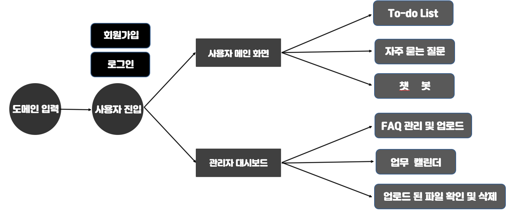
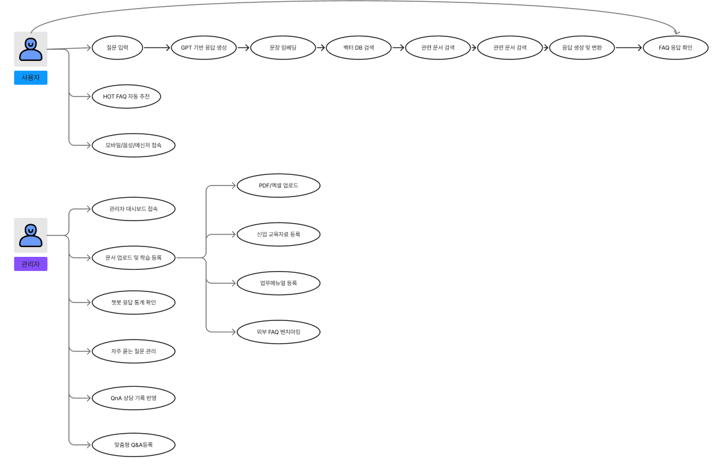
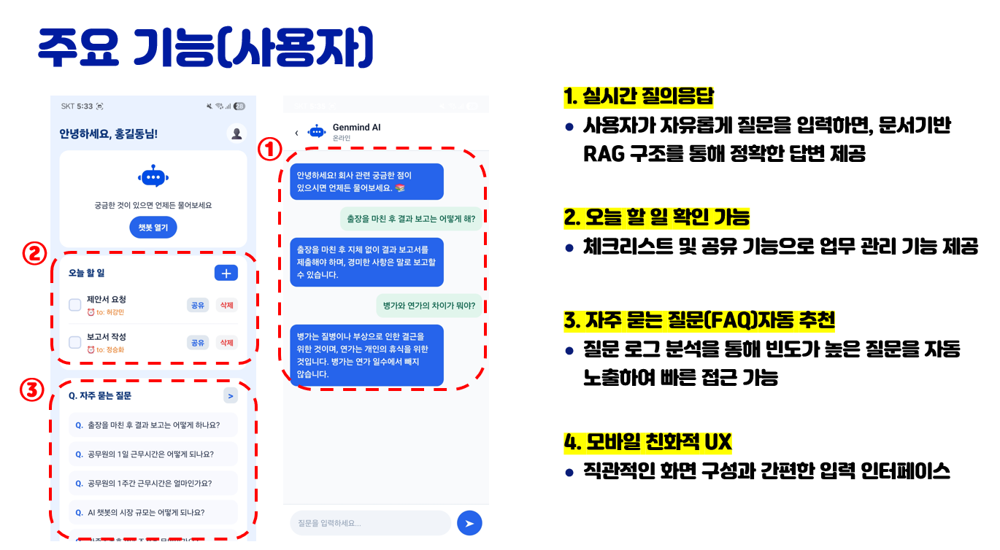
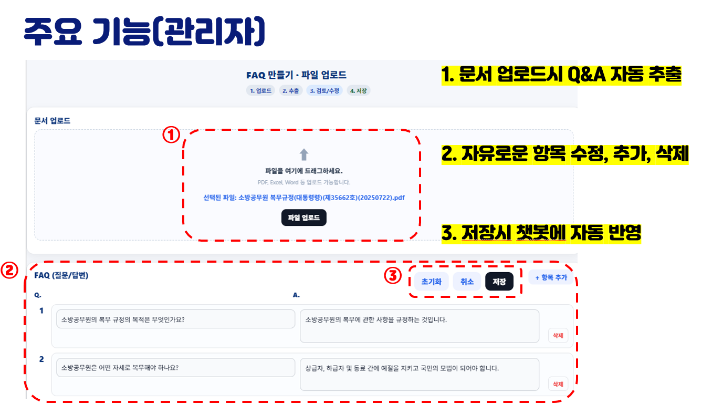
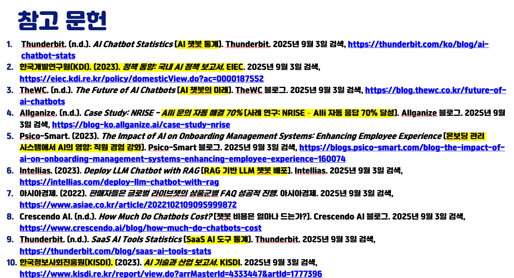

# 👥 팀명 : Genmind
실전프로젝트_Genmind_기업 FAQ 자동응답 챗봇 개발 기획서

## 📌 목차 (Table of Contents)

# 1. 프로젝트 개요

# 2. 주요 기능

# 3. 개발환경

# 4. 유스케이스

# 5. 서비스 아키텍처

# 6. ER 다이어그램

# 7. WEB/앱

# 8. 모델개발 트러블 슈팅

# 9. 팀원역활

# 10. 시연영상

# 11. 참고문헌

- 
# 1. 프로젝트 개요
### 주제 : 중소·중견기업을 위한 문서 기반 자동응답 챗봇 서비스 (Genmind)
- 기업 내부의 규정, 절차서, 매뉴얼(PDF·엑셀 등) 문서를 업로드하면, 이를 자동으로 요약·가공 후 RAG(Retrieval-Augmented Generation) 기반으로 정확하고 일관된 답변을 제공
- OpenAI GPT 모델과 KoSimCSE 임베딩 모델을 활용하여 문서 의미를 벡터화하고, FAISS(Vector DB)**에 저장해 빠르고 신뢰성 있는 질의응답 지원
- FastAPI + MySQL 기반 백엔드로 질문 처리, 문서 관리, FAQ 추천 기능 구현
- React Native(Expo) 기반 모바일 앱으로 질문 입력·HOT FAQ·To-Do List·실시간 응답 기능 제공
- 관리자 웹 대시보드를 통해 비개발자도 엑셀/PDF 업로드, 질문 로그 확인, 미응답 질문 관리 가능
- 기업 내부 커뮤니케이션 효율화, 신입사원 온보딩 자동화, 인건비 절감 등 실질적 효과 달성

# 2. 주요 기능
#### 개발목표
##### 문서 기반 RAG 챗봇 구현
- 기업 내부 규정, 절차서, 매뉴얼(PDF/엑셀 등)을 자동으로 구조화하여 GPT와 연동, 신뢰성 있는 답변을 제공
##### 업무 자동화 및 효율성 향상
- 반복적인 질문에 대해 챗봇이 24시간 자동 응답, 신입사원 온보딩 및 내부 교육 자료 디지털화
##### 비개발자도 쉽게 운영 가능한 환경 구축
- 엑셀 기반 관리 기능을 통해 관리자(비개발자)도 문서를 손쉽게 업로드·보완·운영 가능
##### 데이터 기반 서비스 개선 체계 마련
- 사용자 질문 로그와 미응답 항목을 분석하여 HOT FAQ 자동 추천 및 지속적인 서비스 개선
##### 중소·중견기업 최적화
- 저비용·간편 설치 구조로 기존 챗봇 솔루션의 복잡성과 비용 문제를 해결

## 개발내용

# 3. 개발환경

# 4. 유스케이스

# 5. 서비스 아키텍처

# 6. ER 다이어그램

# 7. WEB/앱 

## A. 주요 기능(사용자) 

## B. 주요 기능(관리자) 

## C. 주요 기능(관리자) 

# 8. 모델개발 트러블 슈팅

## 첫번째 시안

## 두번째 시안

# 9. 팀원역활

# 10. 시연영상
https://github.com/user-attachments/assets/bd71b741-4126-497e-be8e-e281d5603671

# 11. 참고문헌

